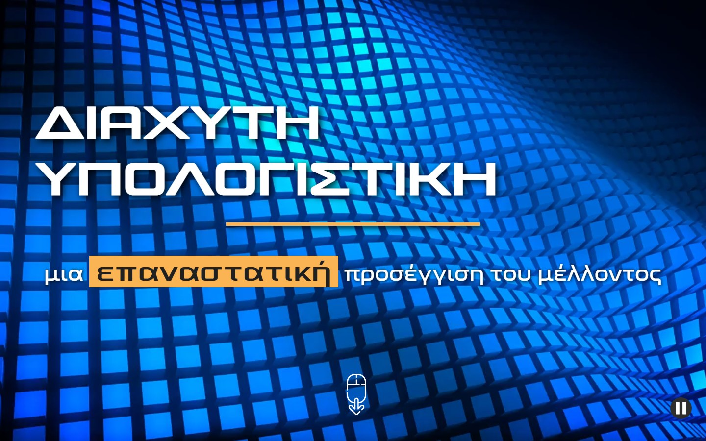

# Ubiquitous Computing: a scrollytelling thesis

[](https://github.com/NikosMav/ubiquitous-computing.github.io/actions/workflows/checks.yml)

**An interactive museum exhibit about ubiquitous computing, created for my 2023 bachelor's thesis at NKUA and completed in 2026.**

The scrollytelling story moves through computing history, the principles of ubiquitous computing, the three waves and a fictional day in a connected future. Around it sit a reading version, a computer-vision lab, check-in quizzes and a personal learning path with points, levels and badges. The scrollytelling story is a desktop exhibit by design; on phones the site hands over to the responsive guide and reading pages.

[Open the story](https://nikosmav.github.io/ubiquitous-computing.github.io/) · [Lab](https://nikosmav.github.io/ubiquitous-computing.github.io/lab.html) · [My journey](https://nikosmav.github.io/ubiquitous-computing.github.io/journey.html) · [Reading version](https://nikosmav.github.io/ubiquitous-computing.github.io/reading.html) · [Thesis PDF](https://pergamos.lib.uoa.gr/uoa/dl/object/3362706/file.pdf)

## Context and contribution

My thesis explored how a museum-oriented digital experience could introduce ubiquitous computing to visitors with different levels of technical knowledge. I worked on research, interaction design, implementation and formative evaluation over approximately twelve months.

The project was proposed and supervised by Associate Professor Maria Roussou at the NKUA Department of Informatics and Telecommunications. It was designed for potential adoption as a digital extension of the planned [Museum of Informatics and Telecommunications](https://museum.di.uoa.gr/). It is an academic exhibit concept, not a confirmed museum installation.

The presentation and educational content are in Greek. This README provides the engineering and research context in English.

## From prototype to exhibit scaffold

The 2023 work was a proof of concept. It told the whole story but built one chapter in depth: computer vision, with three camera applications. Every other application button was deliberately inactive. The aim was a scaffold that later work, such as future theses, could extend chapter by chapter, not a finished catalogue of applications.

The 2026 edition keeps that aim and completes the scaffold around it, using chapter 6 of the thesis as a guide:

| Thesis future work                  | What the site now has                                                                                                                                                                                     |
| ----------------------------------- | --------------------------------------------------------------------------------------------------------------------------------------------------------------------------------------------------------- |
| 6.2.1 Mobile version                | The scrollytelling stays a desktop exhibit, as designed. Phones get a hand-off screen to the responsive guide, reading version, lab and journey, which all work on small screens.                         |
| 6.2.2 Deeper second and third waves | Fuller wave-two chapters (smart homes, cars and clothes), a wave-three trends chapter based on section 3.4.3, check-ins and an epilogue.                                                                  |
| 6.2.3 Personalised learning paths   | The diagnostic quiz gates the story again and chooses the route; an optional profile (interests, learning style) generates a path of chapters, the vision lab and check-ins on "Η διαδρομή μου".          |
| 6.2.4 More interactive applications | Computer vision remains the built application: face, hand and pose experiments with guided missions. The other seven first-wave chapters show an open application slot, three with the thesis' proposals. |
| 6.2.5 Gamification                  | XP, five levels, thirteen badges, toast notifications, check-in quizzes after each wave, a device-local "station" leaderboard with pseudonyms, and a downloadable certificate instead of an email.        |

The camera experiments regain the thesis' gesture classification (pointer, fist, open palm, pinch) using landmark geometry, plus pose and face challenges. They still do not infer identity, age, gender or emotion.

### Hosting a new chapter application

Each first-wave chapter's "Εφαρμογή" panel in `index.html` is a slot. To give a chapter its application:

1. Write `js/labs/<id>.js` exporting `mount(host, { embedded, onComplete })`. Render into `host` and call `onComplete()` once the visitor has done what the application is about.
2. In the chapter's panel, replace the `.story-slot` block with `<div data-uc-lab="<id>"></div>` and remove `data-slot` from its "Εφαρμογή" button. `js/story.js` loads the module when the panel opens.
3. In `js/catalog.js`, add the application to `labs`, set `lab: '<id>'` on the chapter and remove it from `openSlots`. Progress, points, the learning path and the lab hub follow automatically.

## Using the exhibit

- **Story (`index.html`):** scroll through the original scenes. A fixed bar carries the brand, a live breadcrumb (top left, as in the thesis) and the reading progress. Every breadcrumb level links back to its section.
- **Diagnostic quiz:** as in the 2023 prototype, the quiz is the entrance: the chapters stay closed until it is answered, and the score chooses one of the three original routes (newcomers see the history first; the others skip ahead). The route is remembered, so returning visitors are welcomed back rather than gated; deep links from the chapters, labs and journey pass straight through; and a visible choice opens the whole journey without the quiz. An optional profile step then personalises the learning path.
- **Chapters:** each first-wave technology has theory and an application panel. Computer vision opens its three camera experiments; the other chapters show their open slot.
- **Lab (`lab.html`):** the three camera experiments with completion status, and the list of open application slots.
- **Phones:** the story shows a hand-off screen; the guide, reading version, lab and journey are fully responsive.
- **My journey (`journey.html`):** level, stats, the personalised path, check-ins, badges, the station leaderboard and the certificate. Progress can be reset.
- **Reading version (`reading.html`):** every chapter as plain text, linked to its scene. Reading works without JavaScript.

Progress, votes and the leaderboard are stored in the browser (`localStorage`) only. Nothing is sent to a server. The polls and the leaderboard therefore count the visitors of one device, which suits a museum kiosk.

## Design system

All pages share one identity derived from the original story: the wave favicon, royal blue `#4150f0`, amber `#fbb454`, a night-sky navy and the story's typefaces (Venus Rising for the wordmark, Nasalization for labels, Century Gothic for text, Morbodoni for display). `css/brand.css` holds the tokens and the shared bar, breadcrumb, menu, footer and toasts.

The head, header and footer of every page are generated from `scripts/shell.js`. After changing navigation or branding, run:

```bash
npm run shell
```

A test fails if any page drifts from the shared blocks.

## Camera experiments

Face landmarks, hand landmarks and body pose use one shared camera controller and a pinned MediaPipe Tasks Vision runtime. The older prototype helpers and model files are retained as source history but are not loaded by the current experiment pages.

- Video access starts only after an explicit button press; microphone access is never requested.
- Inference runs in a worker, with at most one frame in flight and a 15 fps submission ceiling.
- Stop, navigation, hidden tabs, model failures and timeouts release the stream and terminate the worker. Late permission responses after cancellation are also cleaned up.
- Runtime files are served with the site. Versioned models download from Google's `mediapipe-models` storage only after Start.
- Frames are not recorded or uploaded. Asset requests still disclose ordinary connection metadata to their hosting providers.

## Run and verify

Use Node.js 22 or newer:

```bash
npm ci
npm run build
npm start
```

Open `http://localhost:8000`. Rebuild after editing source. The build copies the static site and locked runtime dependencies into `dist/`. Installed packages, generated output and test reports are ignored by Git.

```bash
npm test
npm run format:check
npm run build
npx playwright install chromium
npm run test:browser
```

Unit tests cover the question and check-in banks, route boundaries, the progress engine, badges and levels, the personalised path, gesture and pose classification, camera cleanup, links, assets and the shared page shell. Browser tests cover the desktop story (the quiz gate and all three routes, disclosures, the seven-scene sequence, the breadcrumb, deep links, the vision panel and an open slot), the phone hand-off, every subpage at desktop and phone sizes with automated axe checks, the quizzes, no-JavaScript reading and the camera experiments with synthetic frames.

The axe checks do not certify the entire original Webflow presentation. Physical-camera quality and Safari/Firefox behaviour still need human testing.

GitHub Actions verifies every push and pull request. Only a successful run on `main` deploys `dist/` to GitHub Pages.

## Original formative evaluation

The **2023 prototype**, not this edition, was evaluated with **13 participants** through a structured questionnaire. Two participants with different technical backgrounds were also observed in person.

Reported outcomes:

- **84.6%** said they felt more knowledgeable about ubiquitous computing.
- **77%** were likely or very likely to recommend the experience.
- Approximately **85%** rated their overall experience positively or very positively.

These are reported perceptions from a small formative study, not a large-scale usability benchmark, measured learning gains or evidence about the 2026 interface.



_The original desktop presentation, restored as the main experience._

## Academic reference and reuse

Nikolaos Mavrapidis, _Design and Development of a Web Application for Ubiquitous Computing_, Bachelor's thesis, Department of Informatics and Telecommunications, National and Kapodistrian University of Athens, October 2023.

Original source code is available under the [MIT License](LICENSE.md). Illustrations, historical screenshots, fonts and model/runtime dependencies retain their respective terms. See [NOTICE.md](NOTICE.md) for provenance and reuse boundaries.
