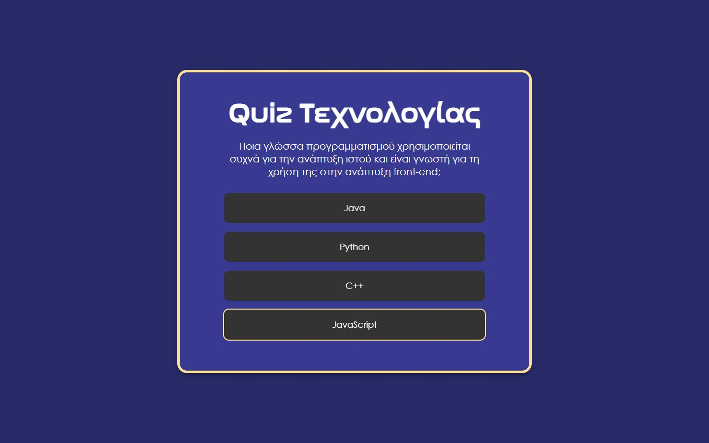
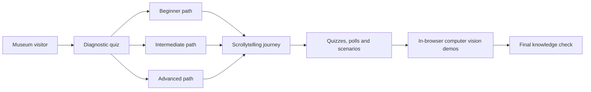

# Ubiquitous Computing Museum Experience

**Bachelor's thesis · NKUA Department of Informatics and Telecommunications · 2023**

An interactive, desktop-first learning experience exploring the history of computing and the three waves of ubiquitous computing. The project was designed as a digital exhibit concept that could complement the forthcoming [Museum of Informatics and Telecommunications](https://museum.di.uoa.gr/) at the National and Kapodistrian University of Athens (NKUA).

[Explore the live experience](https://nikosmav.github.io/ubiquitous-computing.github.io/) · [Read the thesis](https://pergamos.lib.uoa.gr/uoa/dl/object/3362706/file.pdf)

[](https://nikosmav.github.io/ubiquitous-computing.github.io/)

## The challenge

Ubiquitous computing is broad, technical and often invisible by design. The thesis explored how a museum-oriented digital experience could make the subject approachable to visitors with different levels of technical knowledge, while connecting the history of computing with present and future applications.

The work covered the research, interaction design, development and formative evaluation of the experience over approximately twelve months.

## The experience

### Gamified, score-customized learning

The experience begins with a randomized diagnostic quiz. Immediate feedback and a final score place each visitor into one of three paths:

- **Beginner:** starts with the broader history of computing before entering ubiquitous computing
- **Intermediate:** receives a shorter introduction and the core learning journey
- **Advanced:** moves directly into the more specialized material

This is deterministic, score-based content customization rather than a continuously learning recommendation system.



### Scrollytelling and wayfinding

A long-form narrative connects computing history with the three waves of ubiquitous computing. A reading-progress indicator, dynamic breadcrumb navigation and GSAP-powered sequences help visitors remain oriented. The final section uses a persona scenario to depict a day in a future environment where computing is embedded into everyday life.

### Interactive learning

- Introductory and final knowledge quizzes with immediate feedback
- Poll-style interactions visualized with Chart.js
- Multimedia storytelling using video, animation and interactive scenes
- A final knowledge check with an optional souvenir-email concept

### Browser-based computer vision

Three webcam experiments turn computer-vision concepts into direct interactions:

- **Face analysis:** facial landmarks plus estimates of age, expression and gender using face-api.js
- **Hand tracking:** real-time hand and gesture detection using Handtrack.js
- **Pose estimation:** 17-point body tracking using PoseNet and TensorFlow.js

The camera stream is processed in the browser by the prototype; the application code does not upload captured images.

## Formative evaluation

The prototype was evaluated with **13 participants** through a structured questionnaire covering usability, content and perceived educational value. Two participants with different technical backgrounds were also observed using the experience in person.

Reported outcomes:

- **84.6%** said they felt more knowledgeable about ubiquitous computing after the experience
- **77%** were likely or very likely to recommend it
- Approximately **85%** rated their overall experience positively or very positively

These results are directional evidence from a small formative study, not a large-scale usability benchmark.

## Experience architecture



## Technology

- Webflow, HTML, CSS and custom JavaScript
- TensorFlow.js, PoseNet, face-api.js and Handtrack.js
- GSAP ScrollTrigger and Splide
- Chart.js
- GitHub Pages

## Scope and status

This repository preserves the completed October 2023 academic prototype and its public GitHub Pages deployment. The thesis prioritized a desktop museum setting. A dedicated mobile experience, deeper coverage of the second and third waves, richer personalized learning paths and additional gamification were identified as future extensions.

The project was proposed and supervised by Associate Professor Maria Roussou and developed for potential adoption as a digital extension of the planned NKUA Museum of Informatics and Telecommunications. It is preserved here as an academic prototype; no claim of a formal museum deployment is made.

## Run locally

The experience is a static website. Run it through a local HTTP server so that JSON, model and camera-dependent features can load correctly.

```bash
git clone https://github.com/NikosMav/ubiquitous-computing.github.io.git
cd ubiquitous-computing.github.io
python -m http.server 8000
```

Then open `http://localhost:8000`.

## Academic reference

Nikolaos Mavrapidis, *Design and Development of a Web Application for Ubiquitous Computing*, Bachelor's thesis, Department of Informatics and Telecommunications, National and Kapodistrian University of Athens, October 2023.

The original code is available under the [MIT License](LICENSE.md). Third-party media, fonts, libraries and model files remain subject to their respective terms; see [NOTICE.md](NOTICE.md).
